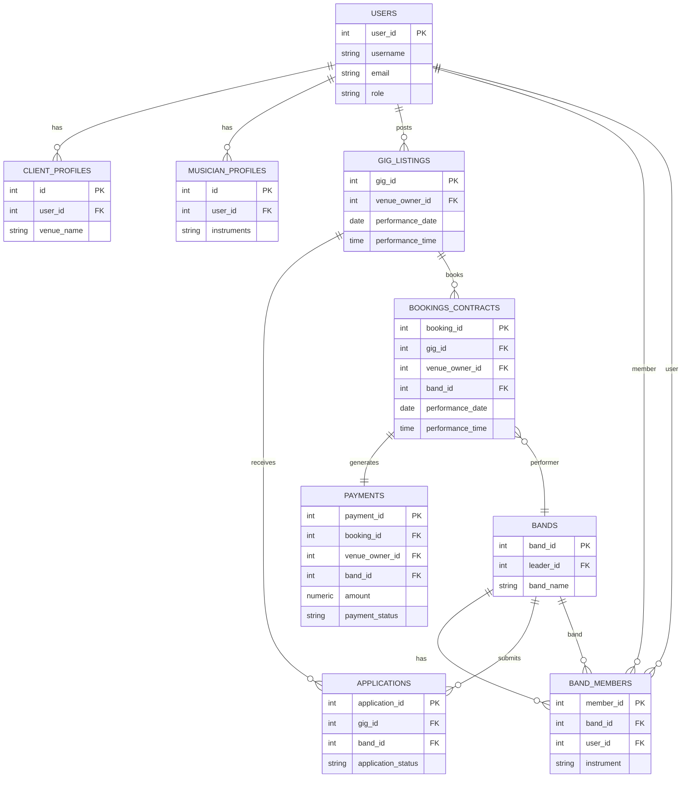

 # GigVault — Backend Overview

 This document describes the GigVault application with emphasis on the backend (models, relationships, query/service APIs, and where code lives). It is intended to help maintainers understand the database schema, how objects relate, and the main entry points for backend logic.

 ---

 ## Project layout (relevant files)

 - `app.py` — Streamlit entrypoint (frontend wiring).
 - `models.py` — SQLAlchemy ORM models (database schema objects).
 - `database.py` — DB session / engine helper (`get_db()` context manager).
 - `queries/` — thin SQLAlchemy query helpers that return tuples or aggregated rows.
   - `booking_queries.py`, `payment_queries.py`, `gig_queries.py`, `dashboard_queries.py`, etc.
 - `services/` — business-logic layer that uses `queries`/`models` and `get_db()`.
   - `application_service.py`, `booking_service.py`, `payment_service.py`, `gig_service.py`, `band_service.py`, `user_service.py`, etc.
 - `pages/` — Streamlit pages that call services and render UI.
 - `components/` — shared UI components and guards (auth, sidebar, etc.).
 - `utils.py` — helpers (formatting, empty states, status badge HTML).

 ---

 ## High-level model summary

 All models are in `models.py` as SQLAlchemy Declarative classes. Primary tables and purpose:

 - `users` (`User`)
   - Core user record (clients and musicians). Key cols: `user_id`, `username`, `email`, `role`.
   - Relationships: `client_profile`, `musician_profile`, `gig_listings`, `client_bookings`, `band_memberships`, `bands_led`.

 - `client_profiles` (`ClientProfile`)
   - Venue-specific metadata (venue_name, venue_type, city, capacity, etc.). One-to-one with `users`.

 - `musician_profiles` (`MusicianProfile`)
   - Musician metadata (instruments, hourly_rate, genres, etc.). One-to-one with `users`.

 - `bands` (`Band`)
   - Represents a band (band_id). Fields: `band_name`, `leader_id`, `genre`, `city`, `bio`.
   - Relationships: `leader` (User), `members` (BandMember), `applications`, `bookings`, `payments`.

 - `band_members` (`BandMember`)
   - Join table between `users` and `bands`: (`band_id`, `user_id`, `role_in_band`, `instrument`). Unique constraint on `(band_id, user_id)`.

 - `gig_listings` (`GigListing`)
   - Gig posted by a venue owner. Key cols: `gig_id`, `venue_owner_id`, `gig_title`, `genre_required`, `location_city`, `performance_date`, `performance_time`, `offered_pay`, `gig_status`.
   - Relationships: `client` (User), `applications`, `booking` (one-to-one BookingContract).

 - `applications` (`Application`)
   - A band applies to a `GigListing`. Key cols: `application_id`, `gig_id`, `band_id`, `cover_letter`, `application_status`, `application_date`.
   - Unique `(gig_id, band_id)` enforced.

 - `bookings_contracts` (`BookingContract`)
   - Created when a client accepts an application. Key cols include `booking_id`, `gig_id`, `venue_owner_id`, `band_id`, `performance_date`, `performance_time`, `agreed_fee`, `contract_status`.
   - Relationships: `gig`, `client` (User), `band`, `payment`.

 - `payments` (`Payment`)
   - Payment record related to a booking. Key cols: `payment_id`, `booking_id`, `venue_owner_id`, `band_id`, `amount`, `payment_status`, `payment_date`.

 - `availability_calendar` (`AvailabilityCalendar`)
   - Represents busy dates for musicians (used to check conflicts).

 - `setlists`, `recruitment_ads`, `reviews_disputes` — supporting tables for features.

 ---

 ## Relationships & cardinality (quick map)

 - `User (1) <— (1) ClientProfile`
 - `User (1) <— (1) MusicianProfile`
 - `User (1) <— (M) GigListing` (as venue owner)
 - `Band (1) <— (M) BandMember — (M) > User` (many-to-many users↔bands)
 - `GigListing (1) <— (M) Application` and `Application.band -> Band`
 - `GigListing (1) <— (1) BookingContract` (once accepted)
 - `BookingContract (1) <— (1) Payment`

 ---

 ## Important indexes & constraints

 - Unique constraints: `uq_application_gig_musician (gig_id, band_id)`, `uq_band_member (band_id, user_id)`, unique booking per gig enforced via `BookingContract.gig_id` unique constraint.
 - Indexes on common filters: gig status, performance_date, application status, payment status.

 ---

 ## APIs (services) and their SQL equivalents

 Services live in `services/` and encapsulate business logic and session-scoped queries. `queries/` contains lower-level query helpers used by services.

 Examples (service → SQL-ish equivalent):

 - `services/application_service.apply_to_gig(user_id, band_id, gig_id, message)`
   - Checks band membership, availability conflicts, duplicate applications and inserts into `applications`.
   - SQL equivalent:
     ```sql
     SELECT 1 FROM band_members WHERE user_id = :user_id AND band_id = :band_id;
     SELECT performance_date FROM gig_listings WHERE gig_id = :gig_id AND gig_status = 'Open';
     INSERT INTO applications (gig_id, band_id, cover_letter, application_status) VALUES (...);
     ```

 - `services/application_service.get_musician_applications(band_id)`
   - Returns all applications for a band (eager-loads `gig`, `booking`, `band.leader` to avoid lazy-loads).
   - SQL equivalent:
     ```sql
     SELECT a.*, g.*, b.*
     FROM applications a
     JOIN gig_listings g ON g.gig_id = a.gig_id
     JOIN bands b ON b.band_id = a.band_id
     WHERE a.band_id = :band_id
     ORDER BY a.application_date DESC;
     ```

 - `services/booking_service.accept_application(application_id, client_id)`
   - Validates pending application + gig open, marks application accepted, creates BookingContract and Payment, inserts availability rows for band members.
   - SQL equivalent (simplified):
     ```sql
     UPDATE applications SET application_status = 'Accepted' WHERE application_id = :id;
     UPDATE gig_listings SET gig_status = 'Filled' WHERE gig_id = :gig_id;
     INSERT INTO bookings_contracts (gig_id, venue_owner_id, band_id, performance_date, performance_time, agreed_fee, contract_status) VALUES (...);
     INSERT INTO payments (...);
     ```

 - `services/payment_service.mark_payment_paid(payment_id, client_id)`
   - Marks a `payments` row as paid and sets `paid_at`.
   - SQL: `UPDATE payments SET payment_status='Completed', payment_date = now() WHERE payment_id=:id AND venue_owner_id=:client`.

 - `services/band_service` functions
   - `get_musician_bands(user_id)`, `get_band_by_id(band_id)`, `create_band`, `join_band`, `get_band_members`.

 Where to find them:

 - `services/application_service.py` — application workflows.
 - `services/booking_service.py` — accept/reject/cancel/complete bookings and create booking/payment records.
 - `services/payment_service.py` — payment lifecycle helpers.
 - `services/gig_service.py` — create/update/cancel gigs; `get_client_gigs` uses eager-loading for booking details.
 - `services/band_service.py` — band membership and active-band management (session integration).
 - `queries/*_queries.py` — lower-level query helper functions that are often passed a `db` Session instance.

 ---

 ## Eager-loading, sessions, and DetachedInstanceError notes

 - UI code (pages) frequently accesses related attributes (e.g., `gig.booking.band.leader.username`). To avoid `sqlalchemy.orm.exc.DetachedInstanceError`, the services/queries use `sqlalchemy.orm.joinedload()` to preload nested relationships while the DB session is open. Look for `.options(joinedload(...))` in `services/*` and `queries/*`.

 Examples added in the codebase:

 - `joinedload(Application.gig).joinedload(GigListing.booking)` — load booking when returning applications.
 - `joinedload(BookingContract.band).joinedload(Band.leader)` — ensure `booking.band` is available after session closes.

 If you see a DetachedInstanceError at runtime, locate the page that triggers it and add the corresponding `joinedload()` to the service function that returns the parent object.

 ---

 ## Session & runtime notes

 - Streamlit session keys used by the app:
   - `st.session_state['user_id']`, `st.session_state['role']` — authentication context.
   - `st.session_state['active_band_id']` — selected band for musician workflows.

 - Run locally (typical):
   ```bash
   python -m venv .venv
   .\.venv\Scripts\activate
   pip install -r requirements.txt
   streamlit run app.py
   ```

 ---

 ## Testing & Debugging tips

 - Use the `services/*` functions directly from a Python REPL or small script with `get_db()` to reproduce issues.
 - When a page throws a DetachedInstanceError, add `joinedload()` for the relationship chain that the template accesses.
 - For schema drift (DB not-null violations), inspect `models.py` and adjust the code that inserts rows (the `services/*` functions) to provide required values (e.g., `performance_date`/`performance_time` on bookings).

 ---

 ## Quick reference: where to change behavior

 - Add new business logic: `services/<area>_service.py`.
 - Add raw queries or optimized joins: `queries/<area>_queries.py`.
 - Add UI that uses services: `pages/<NN_Name>.py`.
 - Add helper UI components: `components/*.py`.

 ---

 If you want, I can also generate a diagram (Mermaid) of the table relationships, or produce a migration script to sync model changes to the database migration tool you use.

 ---

 Generated on: 2026-05-13

## ER Diagram (Mermaid)


